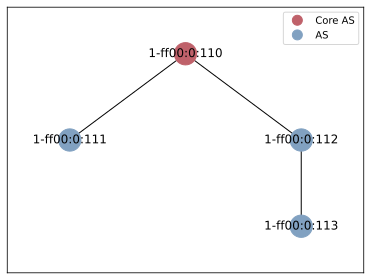

# Scenario: Deny Emissions Above Threshold

This scenario features a policy that denies traffic through hops with any
machine with carbon emissions that are above the specified threshold for the
latest reading collected for that machine (see
`scenario.policies.main.CarbonEmissionsKgThreshold` in
[`hoppipolla.ini`](./hoppipolla.ini)).

The simulated network has the following topology:

## Expected behaviour

The scenario has the following flow:

1. Initialize Hoppipolla SDK client considering `1-ff00:0:111` as the execution context
2. Execute successful `scion ping` to AS `1-ff00:0:113`
3. Publish the policy `policies/main.lp` (generated artifact based on template
   [`policies/main.template.lp`](policies/main.template.lp))
4. Fail to execute `scion ping` to AS `1-ff00:0:113`

## Reasoning

The only link between `1-ff00:0:111` and `1-ff00:0:113` goes through
`1-ff00:0:112`.

The configuration in [`hoppipolla.ini`](./hoppipolla.ini)) generates a set of 4
energy readings with a specific random seed that results in the single reading
for `1-ff00:0:112` to have a `carbonEmissionsKg` field equal to
`34.34756899583733`.

`1-ff00:0:112` therefore has at least 1 machine where its latest reading for
carbon emissions is above the threshold set to `10.0`.

The initial ping is successful as the path exists.

The second ping is not successful because `main.lp` has been published already.
