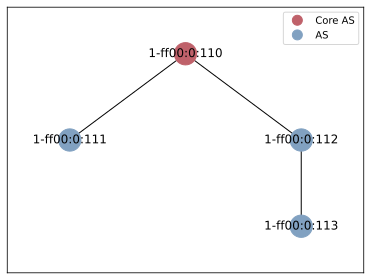

# Scenario: Deny Single Country

This scenario features a policy that denies an AS if it is operating in a specific country (see  
`scenario.policies.main.CountryCode` in [`hoppipolla.ini`](./hoppipolla.ini)).

The simulated network has the following topology:

## Expected behaviour

The scenario has the following flow:

1. Initialize Hoppipolla SDK client considering `1-ff00:0:111` as the execution context
2. Execute successful `scion ping` to AS `1-ff00:0:113`
3. Publish the policy `policies/main.lp` (generated artifact based on template [`policies/main.template.lp`](policies/main.template.lp))
4. Fail to execute `scion ping` to AS `1-ff00:0:113`

## Reasoning

The only link between `1-ff00:0:111` and `1-ff00:0:113` goes through `1-ff00:0:112`.

`1-ff00:0:112` is geographically positioned in the specified `scenario.policies.main.CountryCode`.

The initial ping is successful as the path exists.

The second ping is not successful because `main.lp` has been published already.
